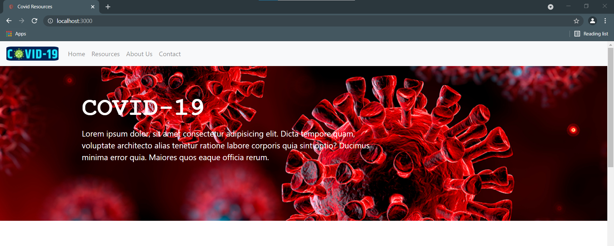

<!-- ## Project Name & Pitch -->
<h1>Covid saadhan</h1>
<!-- #### Example: -->

<!-- TweetWorld  -->
<!-- <h3>Tag line:</h3> -->
<!-- An application used to filter data form Twitter based on user preference, built with React, Redux, JavaScript, and CSS. -->
<h3>Explore the COVID resources here</h3>
<!-- ## Project Status -->
<!-- (only necessary if incomplete) -->

<!-- #### Example: -->
<!-- <h4>OnB</h4> -->
<!-- This project is currently in development. Users can filter tweets by username and keyword and see visual data representation. Functionality to sort by additional parameters is in progress. -->
<h3>Project Idea:</h3>
<p>
We are working on prividing an adequate and verified resources related to COVID at one place.
</p>
## Project Screen Shot(s)

<!-- #### Example: -->

<h3>MAIN Page</h3>
<p align="center" >
  
  
  
</p>

<h3>Resources Page</h3>
<p align="center" >
  
  
</p>

<h3>Admin Page</h3>
<p align="center" >
  
</p>

<h3>Tech Stack:</h3>
<p>Html, Css, Reactjs, Javascript, Bootstrap, Nodejs, Express, MongoDB
</p>

<h3>
Scope of the Project:
</h3>

<p>
This project can be used by the people to find the required resources of the COVID-19 at the time of emergency. The type of resources in this can be updated in the future on the basis of the prescibed medication (provided by the WHO) in the COVID situation or any other pandemic like situations.
</p>

<p align="center">
  Show some love 💜 and Star ⭐️ the Repository to support the project.
</p>

## :rocket: Installation and Setup Instructions

#### Example:

You can get the College After Covid Web App up and running on your localhost in 5 minutes with these four steps:

1. **Clone down this repository. You will need `node` and `npm` installed globally on your machine.**
2. **Installation:**
```npm install```
3. **To Start Server:**
```npm start```
4. **To Visit App:**
```localhost:3000/```

## :red_heart: Thanks
